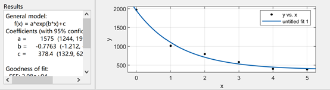

# 
实验D9 虚拟康普顿散射实验

## 
【实验目的】

1.  了解有关康普顿散射的理论基础，理解康普顿散射发生时γ射线的主要散射特征。
2.  掌握闪烁体探测器的基本原理与校正方法。

##  
【仪器用具】

虚拟软件中的数字化设备

---

## 
【实验原理】

### 散射
当光子在传输过程中，受到散射介质的影响，其传输路径发生改变，这种物理现象称之为散射。经典的散射过程，根据散射颗粒与入射光波的波长之比可以分为米散射和瑞利散射，当光子的波长远小于散射颗粒的大小时，一般发生米散射。当光波的波长接近散射颗粒的大小时，发生瑞利散射。由于一般情况下，散射介质中散射颗粒的排布式无规律的，因此散射光的分布也显示出一定的无规律性，只有当对散射颗粒的状态进行大量统计时，散射的分布才会呈现出一定的统计规律。然而，经典的散射由于其能量一般远小于散射介质中电子的束缚能，因此我们一般假定散射中心在散射过程中其位置与速度时不变的。但是当我们逐渐增大散射光的光子能量（散射光频率），我们首先看到的会是康普顿散射。
### 康普顿散射

### 康普顿散射的微分截面

## 
【实验步骤】

## 
【预习思考题】

1. 放射源库：
   提供不同能量的放射源，得到不同能量的γ射线
2. 吸收片库：
   提供不同吸收系数的吸收片
3. 探测器库
   探测γ射线，并将其转化为电信号输出
4. 高压电源
   供电
5. 线性脉冲放大器
   用于闪烁探测器输出信号的成形和放大
6. 单道分析仪
   对信号幅度进行选择
7. 多道分析仪
   接收传感器信号ADC处理后传给计算机
8. 康普顿散射旋转平台
   改变γ射线出射角
9.  移动式γ谱仪
    将探测到的γ射线强度绘制成能谱。
## 
【数据处理】

1. 利用标准放射源测得峰位道址和半高全宽，并对坐标轴标定刻度，获得能量分辨率

2. 更换放射源和不同厚度的NaI吸收片，得到不同的计数率

通过公式$I = ax^\mu+c$拟合得到各个能量下的NaI吸收系数$\mu$。

对各个能量下的NaI吸收系数按模型$\mu = ax^b+c$进行拟合

3. 改变康普顿散射平台的旋转角度，测量$^{137}Cs$的能谱，获得全能峰能量，并通过2中的拟合函数得到该能量下的吸收系数，记录计数率，得到相对微分散射截面。
